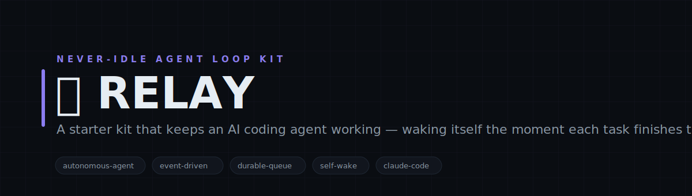
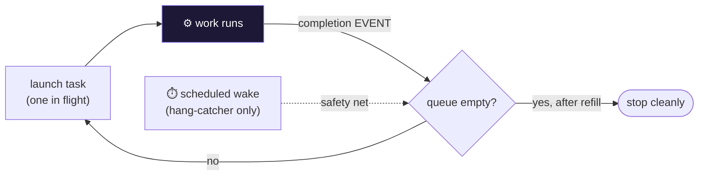
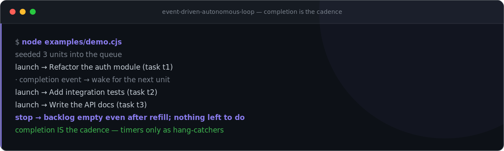

<!-- Event-Driven Autonomous Loop — white-label. No personal or company identifiers in this file by design. -->

<p align="center">
  
</p>

<h1 align="center">🔁 Event-Driven Autonomous Loop</h1>

<p align="center">
  <b>A starter kit that keeps an AI coding agent working — waking itself the moment each task finishes to pick up the next.</b><br>
  <sub>Event-driven continuation for autonomous agent sessions: a durable work queue, a completion-triggered wake, and a stop-hook that continues instead of stalling. Built for long-horizon, big-risk/big-reward work that shouldn't pause between steps.</sub>
</p>

<p align="center">

= 18">

</p>

<p align="center">
<code>autonomous-agent</code> · <code>event-driven</code> · <code>durable-queue</code> · <code>self-wake</code> · <code>claude-code</code> · <code>no-idle</code>
</p>

---

## Why Event-Driven Autonomous Loop

Autonomous agents stall the moment a task ends — they wait for a timer or a human. Event-Driven Autonomous Loop closes that gap: it models work as a durable on-disk queue with exactly one task in flight, and the completion of that task IS the signal to launch the next. A timer is only a safety net, never the driver. The result is a session that keeps making progress on a backlog of heavy work without idling.

---

## What it does

| Module | What it does | Signal |
|---|---|---|
| **queue driver** | Durable on-disk work queue; one task in flight; returns only wait / launch / stop | no fourth idle state |
| **completion wake** | The finishing of the in-flight task is the wake for the next — completion is the cadence | event, not timer |
| **stop-hook** | A reference hook that continues the session on stop when the backlog isn't empty | continues, not stalls |
| **self-wake pattern** | Documented ~90s re-arm cadence via a scheduled wake, used only as a hang-catcher | timer = safety net |

---

## Architecture



---

## Quickstart

```bash
# 1. no install needed — pure Node builtins
node lib/loop-queue.cjs --help

# 2. seed a backlog and see the driver's decision
node examples/demo.cjs

# 3. read the pattern docs, then wire the stop-hook into your agent harness
cat docs/self-wake-pattern.md
```

> Event-Driven Autonomous Loop is a pattern + reference implementation for agent harnesses (it pairs naturally with Claude Code's stop-hook and scheduled-wake). The queue driver is standalone and dependency-free; the hook is an example you adapt to your runtime.

---

## See it run

<p align="center">
  
</p>

---

## Repository layout

```
relay/
├── lib/
│   └── loop-queue.cjs      ← durable queue driver (wait / launch / stop)
├── hooks/
│   └── stop-hook.cjs       ← reference: continue on stop when backlog remains
├── examples/
│   └── demo.cjs            ← seed a queue, watch the decisions
└── docs/
    ├── loop-command.md     ← the /loop-style command doc
    └── self-wake-pattern.md← the ~90s completion-wake cadence explained
```

---

## Concepts

| Concept | Meaning |
|---|---|
| **Completion wake** | Finishing the in-flight task is the wake signal for the next one — the loop never sits on a timer while work exists. |
| **Queue driver** | A durable on-disk work queue; one task in flight at a time; state survives restarts. |
| **wait / launch / stop** | The only three answers the queue ever gives — there is no fourth state where the loop idles with work pending. |
| **Refill** | Before stopping, the loop asks for more work once; stop only happens on a genuinely empty backlog. |
| **Stop-hook** | A reference hook that continues the session on stop when the backlog isn't empty. |
| **Hang-catcher** | The scheduled wake exists only to catch a silently-hung task — never to drive the cadence. |

---

## Design principles

1. **Never idle by construction.** The driver has no 'sit on a timer' state — it's always wait, launch, or stop.
2. **Events drive, timers guard.** Task completion is the cadence; a scheduled wake is only a hang-catcher.
3. **One thing in flight.** Exactly one task runs at a time, tracked durably on disk, so a crash resumes cleanly.
4. **Continue, don't stall.** Stopping is a decision the backlog makes — empty stops, work continues.

---

<p align="center"><sub>Event-Driven Autonomous Loop · queue · completion-wake · never idle · MIT</sub></p>
