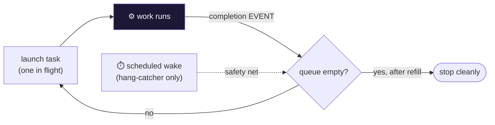

# Event-Driven Autonomous Loop — Architecture

Event-driven continuation for autonomous agent sessions: a durable work queue, a completion-triggered wake, and a stop-hook that continues instead of stalling. Built for long-horizon, big-risk/big-reward work that shouldn't pause between steps.

## Flow

## How it fits together

Event-Driven Autonomous Loop is a durable queue plus the discipline around it. `lib/loop-queue.cjs` holds the state on disk — a backlog, exactly one in-flight task, and history — and its core call returns only `wait` (a task is running; its completion will wake you), `launch` (start this unit now), or `stop` (the queue is empty even after a refill). There is deliberately no fourth outcome, so the loop can never quietly sit on a timer. `hooks/stop-hook.cjs` shows how to wire that into an agent harness: on stop, consult the backlog and continue if work remains. The scheduled-wake cadence documented in `docs/` is a long-interval safety net that fires only if a completion event was somehow missed.

## Extending it

Every capability is a self-contained module. To add your own, follow the contract the existing
modules use and wire it into the entry point. Keep it portable — config via `.env`, no hardcoded
paths, no personal accounts.

## Design principles

1. **Never idle by construction.** The driver has no 'sit on a timer' state — it's always wait, launch, or stop.
2. **Events drive, timers guard.** Task completion is the cadence; a scheduled wake is only a hang-catcher.
3. **One thing in flight.** Exactly one task runs at a time, tracked durably on disk, so a crash resumes cleanly.
4. **Continue, don't stall.** Stopping is a decision the backlog makes — empty stops, work continues.
